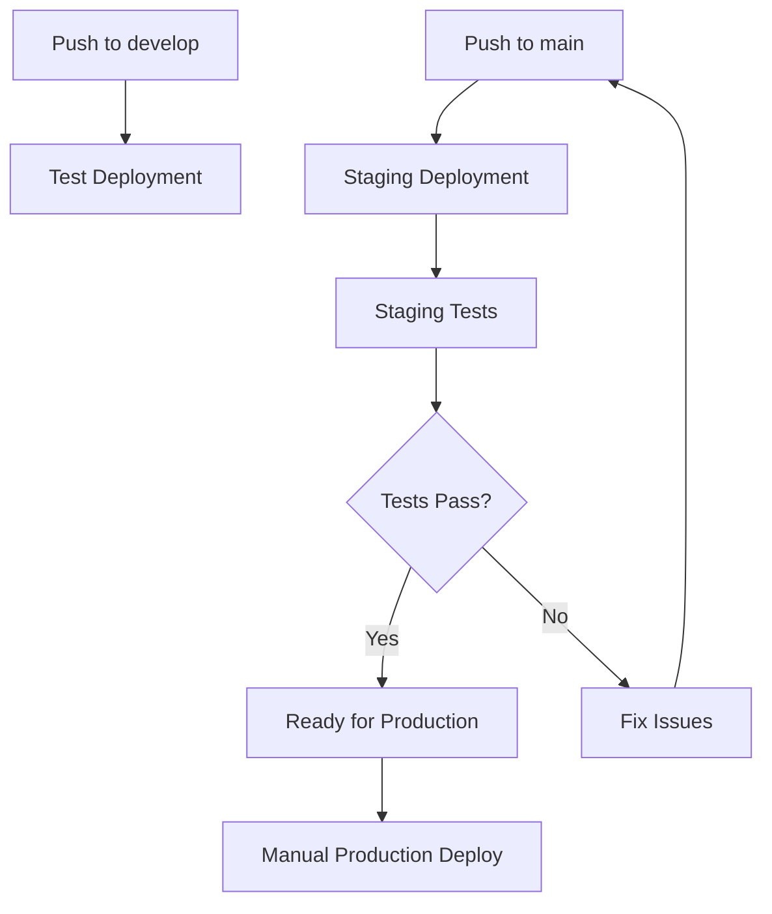

# YouTube AI Platform - Deployment Guide

## 🚀 Complete Deployment Setup for GCP & GitHub Actions

This guide covers the complete setup for deploying the YouTube AI Platform with proper staging, testing, and production workflows.

## Prerequisites

1. **Google Cloud Project** with billing enabled
2. **GitHub Repository** with Actions enabled
3. **Service Accounts** configured in GCP
4. **Domain/SSL** certificates (optional but recommended)

## 🔧 GCP Infrastructure Setup

### 1. Enable Required APIs

```bash
gcloud services enable \
  cloudbuild.googleapis.com \
  run.googleapis.com \
  secretmanager.googleapis.com \
  artifactregistry.googleapis.com \
  cloudresourcemanager.googleapis.com
```

### 2. Create Service Accounts

```bash
# API Service Account
gcloud iam service-accounts create api-service-sa \
  --display-name="API Service Account"

# Worker Service Account  
gcloud iam service-accounts create worker-service-sa \
  --display-name="Worker Service Account"

# GitHub Actions Service Account
gcloud iam service-accounts create github-actions-sa \
  --display-name="GitHub Actions Service Account"
```

### 3. Grant Required Permissions

```bash
PROJECT_ID="your-project-id"

# GitHub Actions SA permissions
gcloud projects add-iam-policy-binding $PROJECT_ID \
  --member="serviceAccount:github-actions-sa@$PROJECT_ID.iam.gserviceaccount.com" \
  --role="roles/run.admin"

gcloud projects add-iam-policy-binding $PROJECT_ID \
  --member="serviceAccount:github-actions-sa@$PROJECT_ID.iam.gserviceaccount.com" \
  --role="roles/artifactregistry.admin"

gcloud projects add-iam-policy-binding $PROJECT_ID \
  --member="serviceAccount:github-actions-sa@$PROJECT_ID.iam.gserviceaccount.com" \
  --role="roles/iam.serviceAccountUser"

# API Service Account permissions
gcloud projects add-iam-policy-binding $PROJECT_ID \
  --member="serviceAccount:api-service-sa@$PROJECT_ID.iam.gserviceaccount.com" \
  --role="roles/cloudsql.client"

# Worker Service Account permissions
gcloud projects add-iam-policy-binding $PROJECT_ID \
  --member="serviceAccount:worker-service-sa@$PROJECT_ID.iam.gserviceaccount.com" \
  --role="roles/cloudsql.client"
```

### 4. Create Artifact Registry Repository

```bash
# For staging
gcloud artifacts repositories create creator-cmd-center-staging \
  --repository-format=docker \
  --location=us-central1

# For production
gcloud artifacts repositories create creator-cmd-center-prod \
  --repository-format=docker \
  --location=us-central1

# For testing
gcloud artifacts repositories create creator-cmd-center-test \
  --repository-format=docker \
  --location=us-central1
```

### 5. Setup Workload Identity Federation

```bash
# Create Workload Identity Pool
gcloud iam workload-identity-pools create "github-actions" \
  --location="global" \
  --display-name="GitHub Actions Pool"

# Create Workload Identity Provider
gcloud iam workload-identity-pools providers create-oidc "github-actions-provider" \
  --location="global" \
  --workload-identity-pool="github-actions" \
  --display-name="GitHub Actions Provider" \
  --attribute-mapping="google.subject=assertion.sub,attribute.repository=assertion.repository,attribute.actor=assertion.actor,attribute.aud=assertion.aud" \
  --issuer-uri="https://token.actions.githubusercontent.com"

# Bind service account to workload identity
gcloud iam service-accounts add-iam-policy-binding \
  --role roles/iam.workloadIdentityUser \
  --member "principalSet://iam.googleapis.com/projects/PROJECT_NUMBER/locations/global/workloadIdentityPools/github-actions/attribute.repository/laziestlarry/youtube-ai-platform" \
  github-actions-sa@$PROJECT_ID.iam.gserviceaccount.com
```

## 🔐 Secrets Management

### 1. Setup GCP Secrets

Run the provided script to create all required secrets:

```bash
# Make sure you have the required environment variables set
./setup_gcp_secrets.sh your-project-id
```

Required secrets:
- `DATABASE_URL`: PostgreSQL connection string
- `REDIS_URL`: Redis connection string  
- `SECRET_KEY`: Application secret key
- `GOOGLE_CLIENT_ID`: OAuth client ID
- `GOOGLE_CLIENT_SECRET`: OAuth client secret
- `GEMINI_API_KEY`: Google AI API key
- `SERPER_API_KEY`: Serper search API key
- `GCS_BUCKET_NAME`: Google Cloud Storage bucket
- `TASK_QUEUE_NAME`: Cloud Tasks queue name
- `WORKER_SA_EMAIL`: Worker service account email

### 2. Setup GitHub Repository Secrets

Add these secrets to your GitHub repository settings:

```bash
# Use the script to set from .env file
./set_github_secrets_from_env.sh .env
```

Required GitHub secrets:
- `GCP_PROJECT_ID`: Your GCP project ID
- `GCP_WORKLOAD_IDENTITY_PROVIDER`: Workload identity provider path
- `GCP_SERVICE_ACCOUNT_EMAIL`: github-actions-sa@PROJECT_ID.iam.gserviceaccount.com

## 🏗️ Deployment Workflows

### Current Workflow Structure

1. **Test Environment** (`deploy-test.yml`)
   - Triggered on push to `develop` branch
   - Deploys to test environment
   - Minimal resources, no environment protection

2. **Staging Environment** (`deploy-staging.yml`)
   - Triggered on push to `main` branch
   - Deploys to staging environment
   - Environment protection enabled
   - Includes staging validation tests

3. **Production Environment** (`deploy-production.yml`)
   - Manual trigger only (`workflow_dispatch`)
   - Deploys to production environment
   - Maximum security and environment protection
   - Warm instances for performance

4. **Staging Validation** (`staging-test.yml`)
   - Runs after staging deployment
   - Comprehensive testing suite
   - Must pass before production deployment

### Deployment Flow



## 🧪 Testing Strategy

### Automated Tests in Staging

The staging validation workflow tests:

1. **Health Checks**: Service availability
2. **API Endpoints**: Basic functionality
3. **Database**: Connection and basic queries
4. **Worker Service**: Background job processing
5. **Performance**: Response times
6. **Security**: Basic header checks
7. **Load Testing**: Light concurrent requests

### Manual Testing Checklist

Before production deployment:

- [ ] Login/logout functionality
- [ ] Video upload and processing
- [ ] Search functionality
- [ ] Background job processing
- [ ] Error handling and logging
- [ ] Mobile responsiveness
- [ ] Cross-browser compatibility

## 📊 Monitoring & Observability

### Cloud Run Monitoring

- Monitor service health in GCP Console
- Set up alerts for high error rates
- Monitor CPU and memory usage
- Track request latency

### Application Logging

```python
# Structured logging for Cloud Logging
import structlog
logger = structlog.get_logger()

logger.info("user_action", user_id=user.id, action="video_upload")
```

### Recommended Alerts

1. High error rate (>5%)
2. High response latency (>2s)
3. Service down
4. High memory usage (>80%)
5. Failed deployments

## 🚨 Troubleshooting

### Common Issues

1. **Deployment Fails**
   - Check service account permissions
   - Verify secrets are properly set
   - Check resource quotas

2. **Service Won't Start**
   - Check application logs in Cloud Run
   - Verify database connectivity
   - Check environment variables

3. **Staging Tests Fail**
   - Review staging test logs
   - Check service health endpoints
   - Verify database migrations

### Rollback Strategy

```bash
# Quick rollback to previous revision
gcloud run services update-traffic SERVICE_NAME \
  --to-revisions=REVISION_NAME=100 \
  --region=us-central1
```

## 🔄 Maintenance

### Regular Tasks

1. **Weekly**: Review error logs and performance metrics
2. **Monthly**: Update dependencies and security patches
3. **Quarterly**: Review and rotate API keys
4. **As needed**: Scale resources based on usage

### Security Updates

```bash
# Update base images regularly
docker pull python:3.11-slim
docker pull node:18-alpine

# Rebuild and redeploy
```

## 📋 Pre-Production Checklist

### Infrastructure
- [ ] All service accounts created and configured
- [ ] Workload Identity Federation setup
- [ ] Artifact Registry repositories created
- [ ] All secrets created in Secret Manager
- [ ] GitHub repository secrets configured

### Testing
- [ ] Test environment deployed and verified
- [ ] Staging environment deployed and verified
- [ ] All staging tests passing
- [ ] Manual testing completed
- [ ] Performance testing completed

### Security
- [ ] Service account permissions reviewed
- [ ] Secrets properly secured
- [ ] No hardcoded credentials in code
- [ ] HTTPS enforced
- [ ] Security headers configured

### Monitoring
- [ ] Logging configured
- [ ] Error tracking setup
- [ ] Performance monitoring active
- [ ] Alerts configured

## 🚀 Production Deployment

1. Ensure all pre-production checks pass
2. Run final staging validation
3. Manually trigger production deployment
4. Monitor deployment progress
5. Verify production health checks
6. Announce deployment to team

---

## Need Help?

- Check workflow logs in GitHub Actions
- Review Cloud Run logs in GCP Console
- Consult this guide for troubleshooting steps
- Contact the development team for assistance
